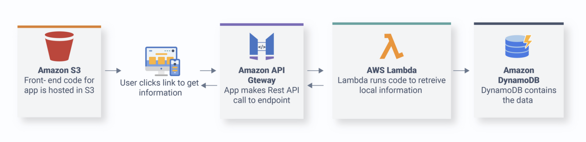
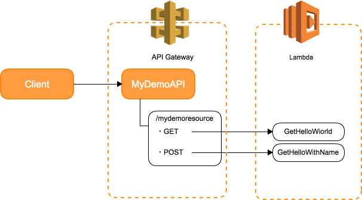

<p align="center">
  <a href="" target="blank"></a>
</p>

[](https://opensource.org/licenses/MIT)

---

# 들어가기 전에...

<p align="center">
<a href="https://youtu.be/ufLmReluPww"></a>
</p>

<br/>
<br/>

# 서비리스(Serverless)

서버리스란, 서버가 없다는 의미입니다. 하지만 서버가 없는 것이 아니라 "서버를 관리할 필요가 없는" 뜻 입니다. 
그렇다면 어떻게 서버를 대신해 준다는 걸까요? 내부적으로는 FaaS(Function as a Service) 혹은 BaaS(Backend as a Service) 정의되는 기술을 사용해서 서버를 대체하게 됩니다.


:heavy_exclamation_mark: 용어
> FaaS(Function as a Service)? 함수(or 람다)만 개발하고 나머지 서버들의 역할을 서비스를 제공하는 쪽(AWS, AZURE, GCP)에서 담당하겠다는 방식
> BaaS(Function as a Service)? 모바일에 특화된 백엔드 개발 서버를 대신해 주는 역할을 하는 방식을 의미함. 


## 최종 목표


 - Route53◊
 - SSL
 - CloudFront
 - S3
 - Auth0
 - Lambda
 - DyanmoDB


## 시작하기

서버리스 프레임워크를 설치하고 프로젝트를 하나 만든 후에 배포 해보자.

> 사전작업: [Node] 설치에서 Node를 설치하면 `npm`이 설치된다.

- 서버리스 프레임워크 설치
```
$ npm install serverless -g
...
> serverless@1.77.1 postinstall /Users/kim.hyunsung/superb/tutorials/serverless-basic/node_modules/serverless
> node ./scripts/postinstall.js


   ┌───────────────────────────────────────────────────┐
   │                                                   │
   │   Serverless Framework successfully installed!    │
   │                                                   │
   │   To start your first project run 'serverless'.   │
   │                                                   │
   └───────────────────────────────────────────────────┘

$ sls --version
Framework Core: 1.60.5
Plugin: 3.2.7
SDK: 2.2.1
Components Core: 1.1.2
Components CLI: 1.4.0
```

- 프로젝트 생성
```
$ sls create --template hello-world
Serverless: Generating boilerplate...
 _______                             __
|   _   .-----.----.--.--.-----.----|  .-----.-----.-----.
|   |___|  -__|   _|  |  |  -__|   _|  |  -__|__ --|__ --|
|____   |_____|__|  \___/|_____|__| |__|_____|_____|_____|
|   |   |             The Serverless Application Framework
|       |                           serverless.com, v1.60.5
 -------'

Serverless: Successfully generated boilerplate for template: "hello-world"
Serverless: NOTE: Please update the "service" property in serverless.yml with your service name
```

- 프로젝트 생성 결과
```
$ tree -L 1 .
.
├── LICENSE
├── handler.js
├── node_modules
├── package-lock.json
└── serverless.yml
```

- 배포
```
$ sls deploy or serverless deploy
Serverless: Packaging service...
Serverless: Excluding development dependencies...
Serverless: Creating Stack...
Serverless: Checking Stack create progress...
........
Serverless: Stack create finished...
Serverless: Uploading CloudFormation file to S3...
Serverless: Uploading artifacts...
Serverless: Uploading service serverless-basic.zip file to S3 (35.17 MB)...
Serverless: Validating template...
Serverless: Updating Stack...
Serverless: Checking Stack update progress...
.................................
Serverless: Stack update finished...
Service Information
service: serverless-basic
stage: dev
region: us-east-1
stack: serverless-basic-dev
resources: 12
api keys:
  None
endpoints:
  GET - https://urxi5ygey0.execute-api.us-east-1.amazonaws.com/dev/hello-world
functions:
  helloWorld: serverless-basic-dev-helloWorld
layers:
  None
Serverless: Run the "serverless" command to setup monitoring, troubleshooting and testing.


   ╭───────────────────────────────────────╮
   │                                       │
   │   Update available 1.60.5 → 1.77.1    │
   │   Run npm i -g serverless to update   │
   │                                       │
   ╰───────────────────────────────────────╯

```

- 프로젝트 제거
```
$ sls remove
Serverless: Getting all objects in S3 bucket...
Serverless: Removing objects in S3 bucket...
Serverless: Removing Stack...
Serverless: Checking Stack removal progress...
.............
Serverless: Stack removal finished...
```
---

## 내부 살펴보기

- Serverless.yml 구성
서버리스 프레임워크의 가장 큰 특징으로는 `환경 구성`과 `소스`가 한꺼번에 관리된다는 것이다. 다시말해 배포하는 소스와 도메인 로직이 한 프로젝트 안에서 관리할 수 있다는 것이다. 개발 후 배포, 배포 후 수정을 좀 더 빨리 할 수 있다는 장점이 있다는 것입니다.

서버리스 프레임워크에서 이런 환경과 소스 구성을 설명하는 파일이 바로 `serverless.yml`파일이다. 해당 파일을 구성을 살펴보면 아래와 같이 구성된다.

**상위 레벨**
```
├── service: 서비스 이름
├── provider: AWS, GCP, AZURE와 같은 클라우드 서비스 제공자
├── plugins: Serverless 프레임워크에서 일반적인 유틸 정의
├── functions: 도메인 로직을 담당하는 함수들 정의
├── resources: 서비스 제공자 제공하는 서비스들 e.g) DB, AWS Lambda, S3 ETC..
```

**상세 예제**
- [Serverless.yml 파일 예제](https://www.serverless.com/framework/docs/providers/aws/guide/serverless.yml/)

- 람다 구조

아래 그림은 우리가 서버를 개발할 때와 구조와 굉장히 비슷하다. 곧 서버리스에서 사용자의 GET or POST 요청이 호출되면 Serverless에서는 API G/W라고 하는 서비스가 요청을 최초롤 받게 되고 특정한 요청 PATH에 해당하는 람다를 호출하게 됩니다.
<p align="center">
  
</p>
아래 소스에서 보면, `/hello-world` 에 GET으로 요청을 보내면 handler.js 파일 안에 `helloWorld` 라는 함수를 호출한다.
즉 `helloWorld`라는 함수에서 필요한 처리를 하고 결과를 돌려주면 된다. 이런 구조는 이전의 서버를 직접 관리할 때의 구조와 동일하다.

```
functions:
  helloWorld:
    handler: handler.helloWorld
    # The `events` block defines how to trigger the handler.helloWorld code
    events:
      - http:
          path: hello-world
          method: get
          cors: true

```

## 프론트엔드 작업하기
프론트 엔드 배포를 위해서는 추가적인 Plugin이 필요하다. `serverless-finch` 플러그인을 활용하여 index.html을 배포하여 보자.


- index.html 파일 설정
```
$ mkdir frontend
$ cd frontend && touch index.html
$ cat index.html
Hello world
```

- [플러그인 설치 및 설정](https://github.com/fernando-mc/serverless-finch)
```
$ npm install --save serverless-finch
```
우선 플러그인을 설치하고 아래처럼 설정해 주면 됩니다.
```
plugins:
  - serverless-finch

custom:
  client:
    bucketName: unique-s3-bucketname # (see Configuration Parameters below)
    # [other configuration parameters] (see Configuration Parameters below)
```

- 클라이언트 배포
```
$ sls client deploy
Serverless: This deployment will:
Serverless: - Upload all files from 'frontend' to bucket 'helloworld-hyunsung-test1'
Serverless: - Set (and overwrite) bucket 'helloworld-hyunsung-test1' configuration
Serverless: - Set (and overwrite) bucket 'helloworld-hyunsung-test1' bucket policy
Serverless: - Set (and overwrite) bucket 'helloworld-hyunsung-test1' CORS policy
? Do you want to proceed? true
Serverless: Looking for bucket...
Serverless: Bucket does not exist. Creating bucket...
Serverless: Configuring bucket...
Serverless: Configuring policy for bucket...
Serverless: Retaining existing tags...
Serverless: Configuring CORS for bucket...
Serverless: Uploading client files to bucket...
Serverless: Success! Your site should be available at http://helloworld-hyunsung-test1.s3-website-us-east-1.amazonaws.com/
```

## 백엔드 작업하기

서버리스에서 사용할 수 있는 DB 중에 하나가 `DynamoDB`입니다. 해당 DB는 `Key` `Value` 형식으로 구성됩니다.
서버리스 프레임워크에서 DB를 만들고 API와 연결해 보자.

- DB 만들기
```
resources:
  Resources:
    TodosDynamoDbTable:
      Type: AWS::DynamoDB::Table
      DeletionPolicy: Retain
      Properties:
        AttributeDefinitions:
          - AttributeName: id
            AttributeType: S
        KeySchema:
          - AttributeName: id
            KeyType: HASH
        ProvisionedThroughput:
          ReadCapacityUnits: 1
          WriteCapacityUnits: 1
        TableName: ${self:provider.environment.DYNAMODB_TABLE}
```

- DB 권한 주기
```
# serverless.yml
environment:
  DYNAMODB_TABLE: tableName
iamRoleStatements:
  - Effect: Allow
    Action:
      - dynamodb:Query
      - dynamodb:Scan
      - dynamodb:GetItem
      - dynamodb:PutItem
      - dynamodb:UpdateItem
      - dynamodb:DeleteItem
```

- API 서비스 만들기

API를 생성을 위해서는 아래와 같이 선언하여 주면 된다.

```
# serverless.yml
---
resources:
  Resources:
    TodosDynamoDbTable:
      Type: AWS::DynamoDB::Table
      DeletionPolicy: Retain
      Properties:
        AttributeDefinitions:
          - AttributeName: id
            AttributeType: S
        KeySchema:
          - AttributeName: id
            KeyType: HASH
        ProvisionedThroughput:
          ReadCapacityUnits: 1
          WriteCapacityUnits: 1
        TableName: ${self:provider.environment.DYNAMODB_TABLE}

```


## TODO
- [ ] 로컬 테스트하기
- [ ] 안전하게 배포하기
- [ ] 다른 언어로 사용하기
- [ ] [도메인 사용해서 프론트 배포하기](https://www.serverless.com/examples/aws-node-single-page-app-via-cloudfront)

## Reference
- [Full stack Serverless](https://www.serverless.com/learn/courses/full-stack-application-development-on-aws/)
- [Serverless Install](https://velopert.com/3549)
